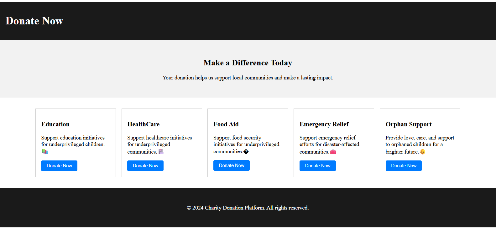

# Charity Donation Platform

A responsive React.js web application that allows users to view and donate to different charitable causes.

## Features

- Responsive layout using CSS Grid/Flexbox
- Categories: Education, Healthcare, Food Aid, Emergency Relief, Orphan Support
- Interactive Donate buttons (currently show alerts)
- Clean Header, Banner, Donation Cards, Footer

## Technologies

- React.js
- JavaScript (ES6+)
- CSS (Inline styles)

## ScreenShot

## How to Run Locally

1. Clone the repo: `git clone https://github.com/yourusername/charity-donation-app.git`
2. Navigate: `cd charity-donation-app`
3. Install dependencies: `npm install`
4. Start the app: `npm start`

